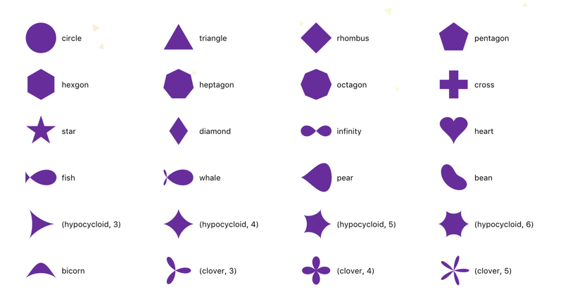

# PostCSS Polygon Shapes

[PostCSS] plugin to generate shapes using `polygon()`. <br/> Ported from [css-doodle].
<br />
<br />
[PostCSS]: https://github.com/postcss/postcss
[css-doodle]: https://yuanchuan.github.io/css-doodle/



```css
.foo {
  clip-path: shape(cross);
}
```

```css
.foo {
  clip-path: polygon(
    5% 35%,  35% 35%, 35% 5%,  65% 5%,
    65% 35%, 95% 35%, 95% 65%, 65% 65%,
    65% 95%, 35% 95%, 35% 65%, 5% 65%
  );
}
```

## Usage

```js
postcss([ require('postcss-polygon-shapes') ])
```

or

```js
postcss([
  require('postcss-polygon-shapes', {
    shapes: {
      myshape: 'polygon(...)'
    }
  })
])
```

See [PostCSS] docs for examples for your environment.
